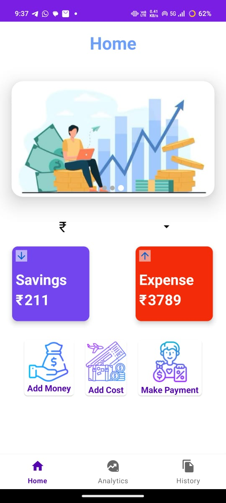
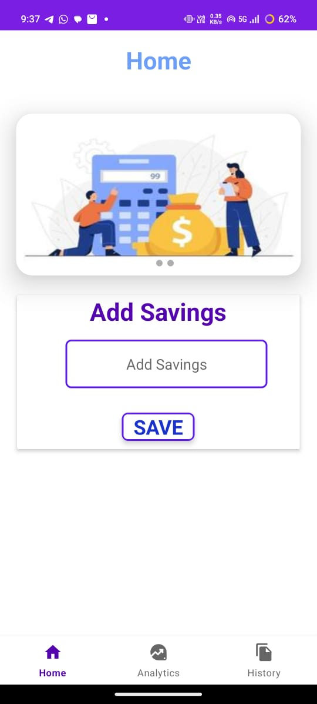
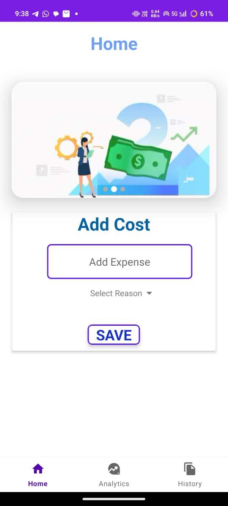
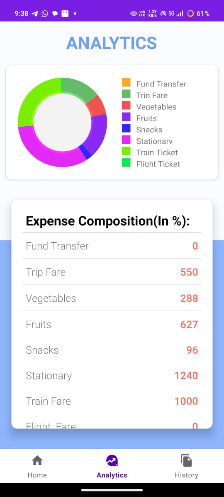
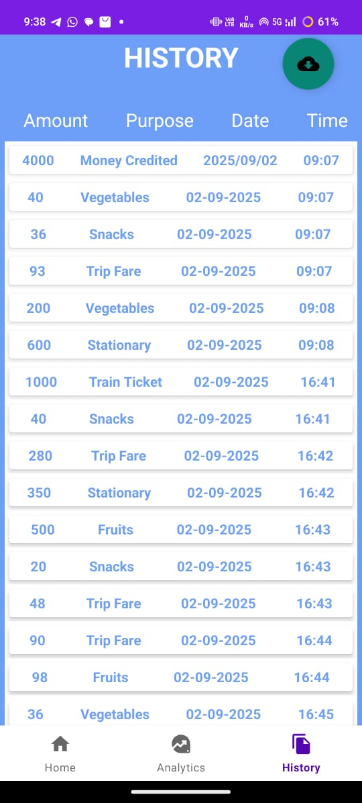
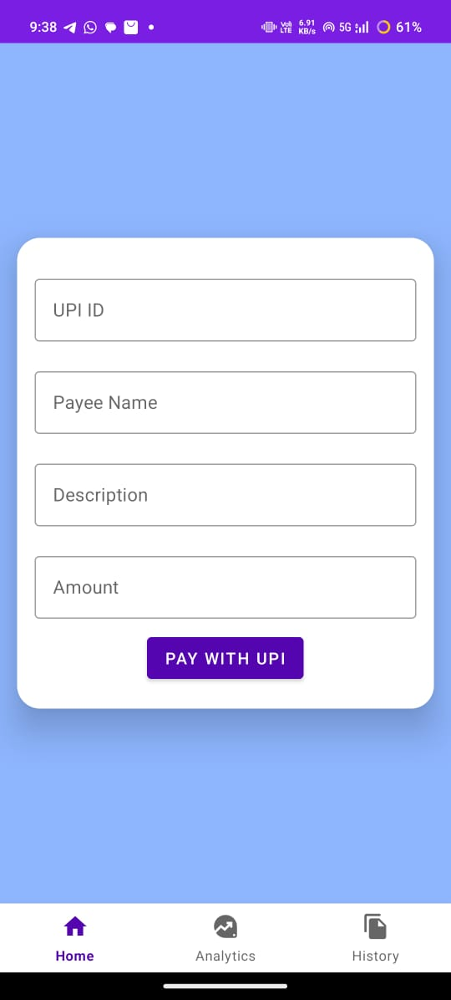

# 📱 Hisab Kitab  

**Hisab Kitab** is an Android application built with **Java** and **SQLite** that helps users manage their daily expenses and savings in a simple and efficient way.  
It provides insights into financial habits through analytics and allows seamless integration with payment applications.  

---
## 🎥 Demo

Here’s a quick demo of **Hisab Kitab App** in action:

---

## ✨ Features
- 💱 **Multi-Currency Support** – User can choose currency of their own choice.  
- 💰 **Expense & Savings Tracking** – Add and manage daily expenses and savings.  
- 📊 **Analytics Dashboard** – Get a pie chart visualization of category-wise spending.
- 📜 **History & Reports** – View complete history of savings and expenses, with the option to **download as PDF**.  
- 💳 **Integrated Payment System** – Redirects to available payment apps on the device, and automatically records the payment in the system.

---

## 📸 Screenshots 

| Home Page | Saving Page | Cost Page |
|--------------|-------------|------------|
|  |  |  |

| Analytics Page | History Page | Payment Screen |
|----------------|----------------|---------------|
|  |  |  |

---

## 🚀 Tech Stack
- **Language:** Java  
- **Database:** SQLite  
- **Libraries/Tools:** Android SDK, MPAndroidChart (for Pie Chart), iText (for PDF generation), Payment Gateway Integration  

---
## 📖 Usage
- Select your preferred currency on first use.
- Add daily income/expenses with category and amount.
- View spending analysis in the Analytics tab.
- Export your expenses history as a PDF report.
- Use the Payment option to pay via external apps and track it automatically.
